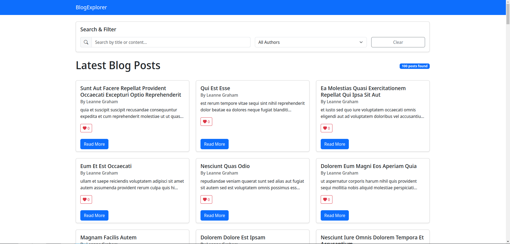
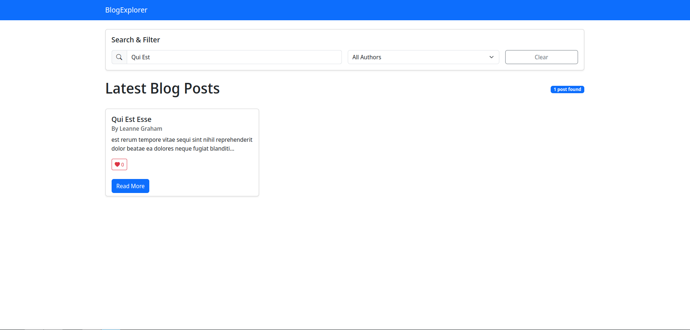
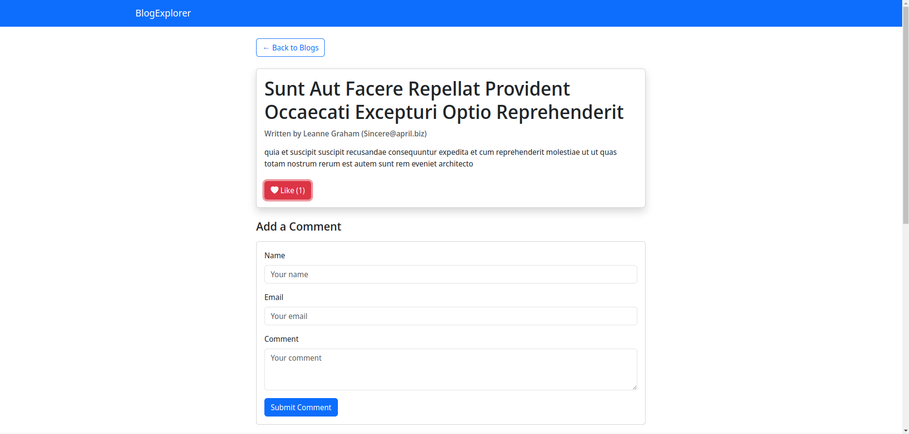
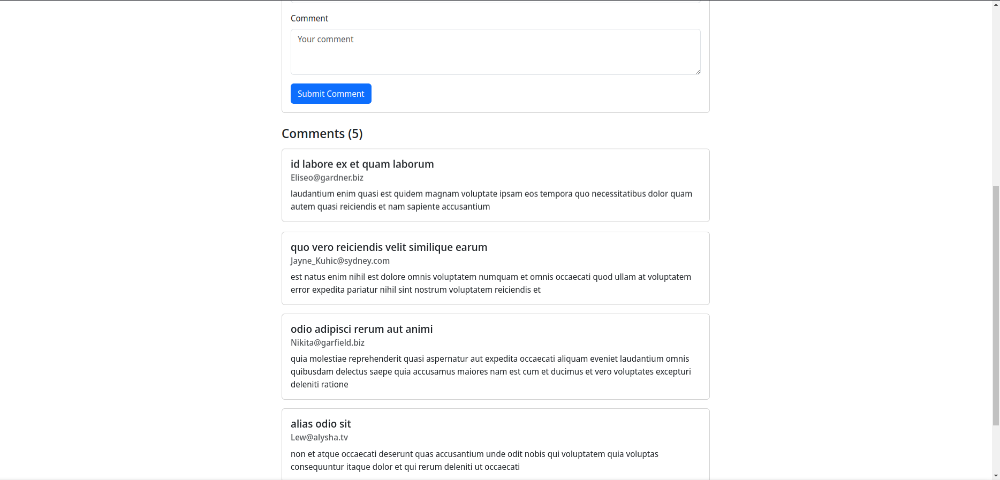

# BlogExplorer

A modern, responsive blog system built with React and Bootstrap that integrates with JSONPlaceholder API for demo purposes.



## Features

### Core Features
- **Blog List:** Display a list of all blog posts with titles, authors, and content previews
- **Blog Details:** View detailed information about a selected blog post
- **Comments:** Read and add comments to blog posts
- **Like System:** Like blog posts with persistent like counts
- **Search & Filter:** Find specific content using search and author filtering

## Technologies Used

- React
- Bootstrap 5
- JSONPlaceholder API
- React Hooks for state management
- Bootstrap Icons

## Installation & Setup

1. Clone the repository:
```bash
git clone https://github.com/yourusername/blog-explorer.git
cd blog-explorer
```

2. Install dependencies:
```bash
npm install
```

3. Start the development server:
```bash
npm start
```

4. Open your browser and navigate to `http://localhost:3000`

## Project Structure

```
blog-explorer/
├── public/
├── src/
│   ├── components/
│   │   ├── BlogCard.js      # Individual blog post card component
│   │   ├── BlogDetail.js    # Blog post detail view component
│   │   ├── BlogList.js      # List of blog posts component
│   │   ├── CommentForm.js   # Form for adding new comments
│   │   ├── Navbar.js        # Navigation bar component
│   │   └── SearchBar.js     # Search and filter component
│   ├── App.js               # Main application component
│   ├── App.css              # Application styles
│   └── index.js             # Entry point
└── package.json
```

## How it Works

BlogExplorer fetches blog data from the JSONPlaceholder API and presents it in a user-friendly interface. Users can:

1. Browse through all blog posts on the home page
2. Click on a post to view its full content and comments
3. Like posts through the heart button
4. Add comments using the comment form
5. Search for posts by keyword
6. Filter posts by author

The application uses React state to manage:
- Currently selected blog post
- Like counts
- Comments list
- Search and filter criteria

## API Integration

The application integrates with the following JSONPlaceholder API endpoints:
- `/posts` - To fetch all blog posts
- `/users` - To get author information
- `/posts/{id}/comments` - To get comments for a specific post

## Future Enhancements

- User authentication system
- Categories and tags for blog posts
- Pagination for blog list
- Rich text editor for comments
- Dark mode support

## Feature Screenshots

### Search & filter blogs


### Read blogs, Like them, Add comments


### View comments from other people


## Acknowledgements

- [JSONPlaceholder](https://jsonplaceholder.typicode.com/) for providing the fake API
- [Bootstrap](https://getbootstrap.com/) for the responsive design components
- [Bootstrap Icons](https://icons.getbootstrap.com/) for the icon set